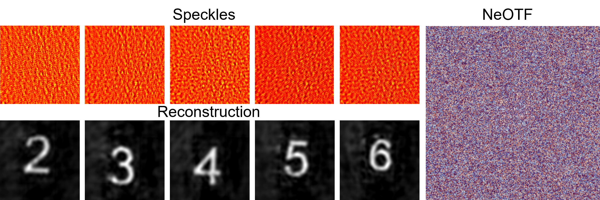

# NeOTF: Neural representation to OTF for scattering imaging 

# How to run

* `NeOTF.py`: train and reconstruct images from default multi-frame speckles.

* `SIREN.py`: files that define the neural network.

* `utils.py`: files that define helper functions.

* `config.yml`: parameter configuration file.

