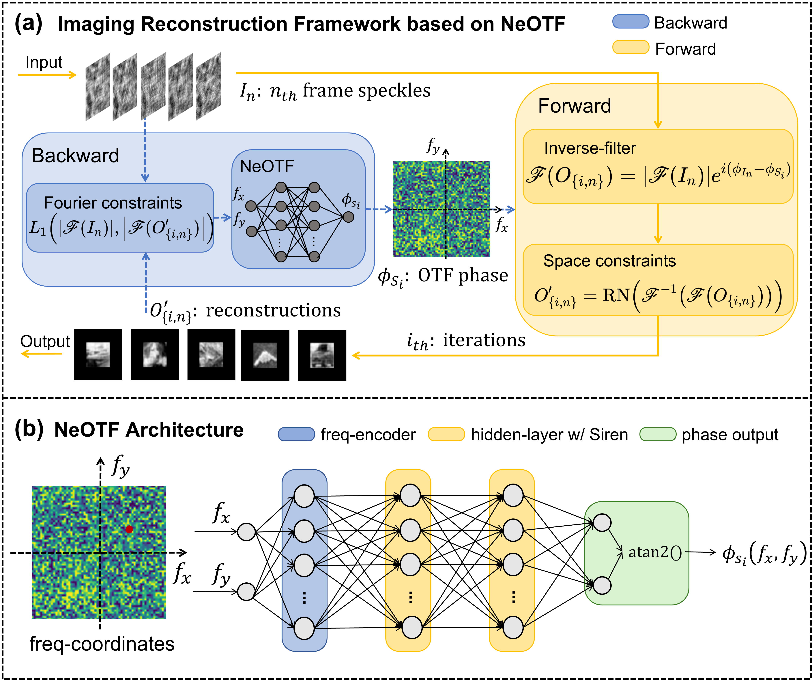
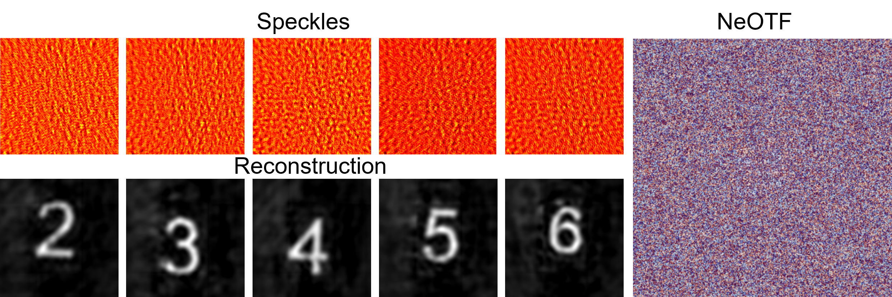

<div align="center">

<h1>NeOTF: Guidestar-free neural representation for broadband dynamic imaging through scattering</h1>

<div>
    <a href='https://coolsyn2000.github.io' target='_blank'>Yunong Sun<sup>1,*</sup></a>&emsp;
    <a href='https://www.xia-lab.com/team' target='_blank'>Fei Xia<sup>1,2,*</sup></a>
</div>
<div>
    <sup>1</sup>Department of Electrical Engineering and Computer Science, University of California, Irvine, CA 92697, USA<br>
    <sup>2</sup>Beckman Laser Institute, University of California, Irvine, CA 92697, USA
</div>
<div>
    <sup>*</sup>Corresponding authors
</div>

---

</div>


<p align="center">
  <a href="https://arxiv.org/abs/2507.22328"></a>
  <a href="https://www.spiedigitallibrary.org/journals/advanced-photonics"></a>
  <a href="https://colab.research.google.com/github/Xia-Research-Lab/NeOTF/blob/main/NeOTF_colab_demo.ipynb"></a>
</p>

#### 🚩Accepted by *Advanced Photonics 2026*

## 🔥 News
- [2026.04] 🎉🎉🎉 Congratulations! NeOTF has been accepted by **Advanced Photonics**.
- [2025.12] The code repo is released on Github.
- [2025.11] The preprint is available on [arXiv](https://arxiv.org/abs/2507.22328).

## 🎬 Overview
<p align="center">
  
</p>

NeOTF is a guidestar-free OTF retrieval method for imaging through dynamic scattering media. By optimizing a neural representation with only a few speckle images from unknown objects, NeOTF robustly retrieves the system's OTF without a guidestar.

## 🔧 Dependencies and Installation

1. Clone repo
    ```bash
    git clone https://github.com/Xia-Research-Lab/NeOTF.git
    cd NeOTF
    ```

2. Install dependent packages
    ```bash
    conda create -n NeOTF python=3.10 -y
    conda activate NeOTF
    pip install torch numpy pillow matplotlib tqdm pyyaml
    ```

## ⚡ Quick Inference

For training and reconstructing images from default multi-frame speckles, simply run:
```bash
python NeOTF.py --config ./config.yml
```

Run all baseline methods (HIO+ER, MORE) alongside NeOTF:
```bash
bash run_main.sh --config config.yml --output_dir ./outputs
```

## 📷 Results

Mutliframe images are reconstructed from inverse filtering with the static OTF retrieved within NeOTF training. The NeOTF is visualized as below. 

<p align="center">
  
</p>
<p align="center"></p>

## 🧩 Repository Structure
* `NeOTF.py`: Main NeOTF training and reconstruction pipeline.
* `MORE.py`: MORE algorithm baseline.
* `HIOER.py`: HIO+ER algorithm baseline.
* `SIREN.py`: Neural network module.
* `utils.py`: Data loading and helper functions.
* `config.yml`: Default configuration file.
* `run_main.sh`: Benchmark bash script.

## 🎓 Citations
If our code helps your research or work, please consider citing our paper.
```bibtex
@article{sun2025neotf,
  title={NeOTF: Guidestar-free neural representation for broadband dynamic imaging through scattering},
  author={Sun, Yunong and Xia, Fei},
  journal={arXiv preprint arXiv:2507.22328},
  year={2025}
}
```


